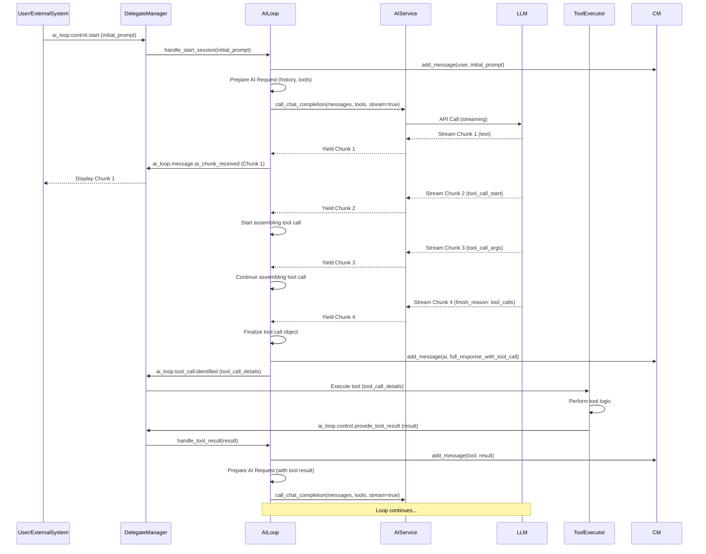

# Refactored AI Loop Design

## 1. Introduction

This document outlines the design for a refactored, standalone AI loop component. The primary goal is to create a general-purpose, interactive, and stream-capable AI interaction module, decoupled from the specifics of the current `ExecutionEngine` and `StateManager`. This design is based on the analysis provided in [`docs/ai_loop_refactor_analysis.md`](docs/ai_loop_refactor_analysis.md).

## 2. Goals

The refactored AI loop aims to achieve:

- **Decoupling:** Operate independently of `ExecutionEngine` and `StateManager`'s internal implementations.
- **Interactivity:** Support ongoing, two-way conversations with the user, allowing user input at various points.
- **Streaming:** Handle streaming of AI responses (text, tool calls) for real-time feedback.
- **Generality:** Be adaptable for various AI models, tasks, and toolsets.
- **Control:** Allow external control over the loop's lifecycle (start, stop, pause, resume) via the `DelegateManager`.

## 3. Core Components

The refactored AI loop will consist of the following core components:

### 3.1. `AILoop` Class

The central component responsible for managing the AI interaction lifecycle.

- **Responsibilities:**
  - Orchestrating the conversation flow.
  - Interacting with the `AIService` for model communication.
  - Managing conversation state via a `ContextManager`.
  - Handling user input and AI responses (including streaming).
  - Processing tool calls (identification and potentially delegating execution).
  - Emitting events and responding to control signals via `DelegateManager`.
- **Key Attributes:**
  - `config: AIConfig`
  - `ai_service: AIService`
  - `context_manager: ContextManager`
  - `delegate_manager: DelegateManager`
  - `shutdown_event: asyncio.Event` (or similar for graceful termination)
  - `pause_event: asyncio.Event` (for pausing/resuming)
- **Nature:** Asynchronous (`async/await`).

### 3.2. `AIConfig` Data Structure

A dedicated configuration object or dataclass to pass settings to the `AILoop`.

- **Contents:**
  - AI model parameters (model ID, temperature, max tokens, etc.).
  - System prompt.
  - Tool usage instructions/preamble.
  - API details for the `AIService` (if not handled by `AIService` instantiation directly).
  - Configuration for error handling strategies.
  - Streaming options (e.g., chunk size, timeouts).

### 3.3. `AIService` Interface (Abstract Base Class)

An abstraction for interacting with different AI language models.

- **Responsibilities:**
  - Sending requests to the AI model (with history, system prompt, tools).
  - Receiving responses, supporting both full and streaming modes.
  - Formatting tool definitions for the specific AI model.
  - Handling API-specific errors and translating them to generic errors if possible.
- **Key Methods (Illustrative):**
  - `async def call_chat_completion(self, messages: List[Dict], tools: Optional[List[Dict]], stream: bool = False, **kwargs) -> AsyncIterator[AIStreamChunk]`
  - `def format_tools_for_model(self, tool_registry_data: Any) -> List[Dict]`
- **Implementations:** Specific classes like `OpenRouterService`, `OpenAIService`, etc., would implement this interface.

### 3.4. `ContextManager` Interface (Usage)

The `AILoop` will continue to depend on the `ContextManager` *interface* for managing conversation history.

- **Interaction:**
  - `add_message()`: To add user, AI, and tool messages.
  - `get_history()`: To retrieve messages for the AI.
  - `clear_history()`: To reset the conversation.
- **Decoupling:** The `AILoop` will not be concerned with how the `ContextManager` is persisted; this responsibility lies with the component that instantiates and provides the `ContextManager` to the `AILoop`.

### 3.5. `DelegateManager` Integration

The `DelegateManager` will be the primary mechanism for external interaction, observation, and control.

- **Notifications (Events Emitted by `AILoop`):**
  - `ai_loop.session_started`
  - `ai_loop.session_ended` (with reason: completed, stopped, error)
  - `ai_loop.message.user_processed`
  - `ai_loop.message.ai_chunk_received` (for streaming text)
  - `ai_loop.message.ai_full_received`
  - `ai_loop.tool_call.identified` (with tool details, potentially streamed)
  - `ai_loop.tool_call.result_processed`
  - `ai_loop.status.paused`
  - `ai_loop.status.resumed`
  - `ai_loop.error` (with error details)
- **Control (Events Consumed by `AILoop`):**
  - `ai_loop.control.start` (with initial input/prompt)
  - `ai_loop.control.stop`
  - `ai_loop.control.pause`
  - `ai_loop.control.resume`
  - `ai_loop.control.send_user_message` (for interactive input)
  - `ai_loop.control.provide_tool_result` (if tool execution is delegated)

## 4. Key Operations and Interactions

### 4.1. Initialization

- The `AILoop` is instantiated with `AIConfig`, an `AIService` implementation, a `ContextManager`, and a `DelegateManager`.
- A shutdown event and pause event are initialized.

### 4.2. Starting an AI Session

- Triggered by `ai_loop.control.start` delegate or a direct method call.
- The main asynchronous loop begins.
- `ai_loop.session_started` event is emitted.

### 4.3. Main Interaction Loop (Conceptual)

```python
async def run_session(self, initial_prompt: str):
    # Add initial prompt to context
    # Emit ai_loop.session_started
    while not self.shutdown_event.is_set():
        await self.pause_event.wait() # Pauses if event is cleared

        # 1. Prepare AI Request (get history, system prompt, tools)
        # 2. Call AIService (potentially streaming)
        # 3. Process AI Response:
        #    - If streaming:
        #        - Yield/emit text chunks (`ai_loop.message.ai_chunk_received`)
        #        - Accumulate full response
        #        - Handle streamed tool calls (`ai_loop.tool_call.identified` for partial, then full)
        #    - If not streaming:
        #        - Emit full response (`ai_loop.message.ai_full_received`)
        #        - Handle tool calls
        # 4. Add AI response to ContextManager
        # 5. Handle Tool Calls:
        #    - If tool calls present:
        #        - Emit `ai_loop.tool_call.identified`
        #        - Option 1: Execute tool directly (if AILoop has this capability)
        #        - Option 2: Delegate execution (emit event, wait for `ai_loop.control.provide_tool_result`)
        #        - Add tool result to ContextManager
        #        - Loop back to step 1 (send tool result to AI)
        # 6. Await further user input (if interactive) or decide to end.
        #    - Listen for `ai_loop.control.send_user_message`
        #    - If no more interaction needed and no tool calls, session might end.
    # Emit ai_loop.session_ended
```

### 4.4. Streaming Data Flow

- `AIService` yields chunks (e.g., text tokens, partial JSON for tool calls).
- `AILoop` consumes these chunks.
- Text chunks are immediately emitted via `DelegateManager` (`ai_loop.message.ai_chunk_received`).
- Tool call chunks are assembled; `ai_loop.tool_call.identified` might be emitted with partial data, then with complete data.

### 4.5. Tool Call Handling

- **Identification:** AI response indicates a tool call.
- **Execution:**
  - **Option A (Integrated):** `AILoop` has access to a `ToolRegistry` (passed or accessible via `AIService` or `AIConfig`) and executes the tool.
  - **Option B (Delegated):** `AILoop` emits `ai_loop.tool_call.identified` and waits for an external component to execute the tool and provide the result via `ai_loop.control.provide_tool_result`. This enhances generality.
- **Result:** Tool result is added to `ContextManager` and sent back to the AI.

### 4.6. Interactivity

- User messages can be sent at any time via `ai_loop.control.send_user_message`.
- The `AILoop` incorporates these messages into the `ContextManager` and typically triggers another iteration of AI interaction.

### 4.7. Session Control

- **Pause/Resume:** `ai_loop.control.pause` clears an internal `asyncio.Event`; `ai_loop.control.resume` sets it. The main loop `await`s this event.
- **Stop:** `ai_loop.control.stop` sets the `shutdown_event`, causing the main loop to terminate gracefully.

## 5. Interface Definitions (High-Level)

### 5.1. `AILoop`

```python
class AILoop:
    def __init__(self, config: AIConfig, ai_service: AIService, context_manager: ContextManager, delegate_manager: DelegateManager): ...
    async def start_session(self, initial_prompt: str, tool_registry: Optional[Any] = None): ... # Main entry point
    async def stop_session(self): ...
    async def pause_session(self): ...
    async def resume_session(self): ...
    async def send_user_message(self, message: str): ...
    # Internal methods for handling delegate events for control
```

### 5.2. `AIService` (Interface)

```python
from abc import ABC, abstractmethod
from typing import List, Dict, Any, Optional, Union, AsyncIterator # Added for clarity

# Placeholder for structured tool definition
class ToolDefinition:
    name: str
    description: str
    parameters: Dict[str, Any] # JSON Schema for parameters

# Simplified AI Response Structures
class ToolCall:
    id: str
    type: str # e.g., "function"
    function: Dict[str, str] # {"name": "...", "arguments": "..."}

class AIResponse:
    content: Optional[str]
    tool_calls: Optional[List[ToolCall]]
    finish_reason: str # e.g. "stop", "tool_calls", "length"

class AIStreamChunk:
    delta_content: Optional[str]
    delta_tool_call_part: Optional[Any] # For streaming tool call construction (e.g., parts of a JSON string)
    finish_reason: Optional[str]
    # May need chunk index or ID if multiple tool calls can be streamed interleaved.

class AIService(ABC):
    @abstractmethod
    async def call_chat_completion(
        self,
        messages: List[Dict[str, Any]],
        tools: Optional[List[Dict[str, Any]]] = None,
        tool_choice: Optional[Union[str, Dict]] = None, # e.g. "auto", "none", {"type": "function", "function": {"name": "my_function"}}
        stream: bool = False,
        **kwargs  # For model-specific params like temperature, max_tokens
    ) -> Union[AIResponse, AsyncIterator[AIStreamChunk]]: ...

    @abstractmethod
    def format_tools_for_model(self, tool_definitions: List[ToolDefinition]) -> List[Dict[str, Any]]: ...
```

### 5.3. Key `DelegateManager` Topics (already listed in 3.5)

## 6. Diagrams

### 6.1. Component Interaction Diagram

```mermaid
graph TD
    UserInterface[User Interface / External System] -- Control Events & User Input via DelegateManager --> DM{DelegateManager}
    DM -- Control Events --> AILoop[AILoop]
    AILoop -- AI Requests --> AISrv[AIService Interface]
    AISrv -- API Calls --> LLM[Language Model API]
    LLM -- API Responses (Streamed/Full) --> AISrv
    AISrv -- AI Responses (Streamed/Full) --> AILoop
    AILoop -- History Ops --> CM[ContextManager]
    AILoop -- Configuration --> Cfg[AIConfig]
    AILoop -- Notification Events via DelegateManager --> DM
    DM -- Notification Events --> UserInterface
    DM -- Notification Events --> OtherSubscribers[Other Subscribers]

    subgraph Refactored AILoop System
        AILoop
        AISrv
        CM
        Cfg
    end

    ToolExecutor[Tool Executor (Optional, External)]
    DM -- ai_loop.tool_call.identified --> ToolExecutor
    ToolExecutor -- ai_loop.control.provide_tool_result --> DM
```

### 6.2. Sequence Diagram: Streaming Interaction with Tool Call (Delegated Execution)



## 7. Addressing Requirements

- **Decoupling:**
  - `AIConfig` replaces direct `engine.config` access.
  - `AIService` interface decouples from `OpenRouterAIService` specifics.
  - `ContextManager` remains an interface, decoupling from `StateManager` persistence.
  - Generic `asyncio.Event` for shutdown/pause instead of `engine.shutdown_event`.
- **Interactivity:**
  - `ai_loop.control.send_user_message` delegate allows injecting user messages.
  - Loop designed to incorporate new messages and re-query AI.
- **Streaming:**
  - `AIService` supports streaming responses.
  - `AILoop` is asynchronous and processes `AIStreamChunk`s.
  - Delegates like `ai_loop.message.ai_chunk_received` and `ai_loop.tool_call.identified` (potentially with partial data) facilitate real-time updates.
- **Generality:**
  - System prompt and tool instructions are part of `AIConfig`.
  - `AIService` abstracts AI provider specifics.
  - Tool execution can be delegated externally, making the loop itself not dependent on a specific `ToolRegistry` implementation for execution.
  - Error handling is configurable and reported via `DelegateManager`.
- **Control:**
  - Pause, resume, stop are handled via `DelegateManager` events and internal `asyncio.Event`s.

## 8. Conclusion

This design provides a robust foundation for a standalone, interactive, and stream-capable AI loop. By leveraging interfaces like `AIService` and `ContextManager`, and integrating deeply with `DelegateManager` for communication and control, the refactored `AILoop` will be a versatile component suitable for a wide range of AI-driven applications within the AIWhisperer ecosystem.
