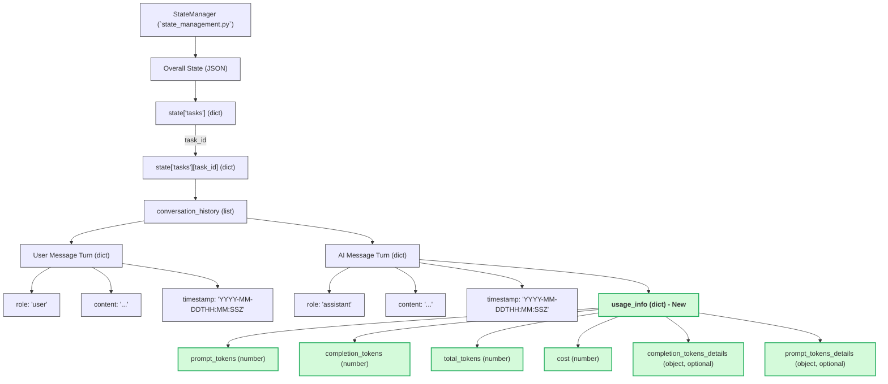

# Design for Storing AI Interaction Cost and Token Information

## 1. Introduction

This document outlines the design for integrating the storage of AI interaction cost and token usage information within the existing state management system of the AI Whisperer application. This design is based on the analysis of the current state management implementation found in [`src/ai_whisperer/state_management.py`](src/ai_whisperer/state_management.py:1) and the cost/token data available from the OpenRouter API, as detailed in [`docs/cost_token_analysis_summary.md`](docs/cost_token_analysis_summary.md:1).

The goal is to ensure that cost and token metrics are captured and stored alongside the relevant AI interaction in the message history, providing a clear record for monitoring and analysis.

## 2. Existing State Management Structure for Conversation History

The `StateManager` class in [`src/ai_whisperer/state_management.py`](src/ai_whisperer/state_management.py:1) is responsible for managing the application's state, which is persisted to a JSON file. For each task, conversation history is stored within the task's specific state object under the key `conversation_history`. This key holds a list of "message turn" dictionaries.

Specifically, the structure is: `state['tasks'][task_id]['conversation_history'] = []`, where each element in the list is a dictionary representing a single message turn (e.g., a user prompt or an AI response). The [`store_conversation_turn()`](src/ai_whisperer/state_management.py:234) method is used to append new message turns to this list.

## 3. Cost and Token Data to be Stored

Based on the analysis in [`docs/cost_token_analysis_summary.md`](docs/cost_token_analysis_summary.md:1), the following key fields from the OpenRouter API's `usage` object need to be captured and stored for each AI interaction:

*   **`prompt_tokens`** (number): The number of native tokens processed from the input prompt.
*   **`completion_tokens`** (number): The number of native tokens generated in the AI's response.
*   **`total_tokens`** (number): The sum of `prompt_tokens` and `completion_tokens`.
*   **`cost`** (number): The cost of the API call (e.g., in OpenRouter credits, typically a float).
*   **`completion_tokens_details`** (object, optional): May contain further details like `reasoning_tokens`.
*   **`prompt_tokens_details`** (object, optional): May contain further details like `cached_tokens`.

Additionally, a timestamp will be recorded for each message turn to provide temporal context.

## 4. Proposed Design for Storing Cost and Token Data

To integrate cost and token information, the existing structure of the AI assistant's message turn dictionary within the `conversation_history` list will be augmented.

### 4.1. Storage Location and New Key

The cost and token data, obtained from the OpenRouter API's `usage` object, will be stored directly within the dictionary representing the AI assistant's message turn.
A new key, **`usage_info`**, will be added to the AI assistant's message turn dictionary. This key will hold the entire `usage` object returned by the API.

### 4.2. Timestamping

Each message turn dictionary (for both user and assistant messages) will include a **`timestamp`** field.
*   **Format:** ISO 8601 UTC string (e.g., `YYYY-MM-DDTHH:MM:SS.ffffffZ`).
*   **Purpose:** This timestamp will indicate when the message turn was recorded, allowing the `usage_info` to be precisely associated with the timing of the AI interaction. The component generating the message turn (e.g., the AI interaction handler) will be responsible for creating this timestamp.

### 4.3. Schema Modification (Illustrative JSON)

The following examples illustrate the proposed structure for message turns:

**AI Assistant's Message Turn (with `usage_info`):**
```json
{
  "role": "assistant",
  "content": "This is the AI's response to the user.",
  "timestamp": "2025-05-11T18:30:05.123456Z",
  "usage_info": {
    "prompt_tokens": 120,
    "completion_tokens": 85,
    "total_tokens": 205,
    "cost": 0.00045,
    "completion_tokens_details": {
      "reasoning_tokens": 10 
    },
    "prompt_tokens_details": {
      "cached_tokens": 5
    }
  }
  // Any other existing or future fields related to the message
}
```

**User's Message Turn (with `timestamp`, without `usage_info`):**
```json
{
  "role": "user",
  "content": "This is the user's prompt to the AI.",
  "timestamp": "2025-05-11T18:29:59.987654Z"
  // Any other existing or future fields related to the message
}
```

### 4.4. Data Types

The data types for the fields within `usage_info` will be as follows:
*   `prompt_tokens`: Integer
*   `completion_tokens`: Integer
*   `total_tokens`: Integer
*   `cost`: Float (or Number, to accommodate various precisions)
*   `completion_tokens_details`: Object (or null/absent if not provided)
*   `prompt_tokens_details`: Object (or null/absent if not provided)
*   `timestamp`: String (ISO 8601 format)

### 4.5. Association with AI Interaction

By embedding the `usage_info` object and the `timestamp` directly within the AI assistant's message turn dictionary, the cost, token metrics, and timing are explicitly linked to the specific AI interaction that generated that response. This ensures a clear and auditable record.

## 5. Impact on `StateManager` and Data Flow

*   **`StateManager` Class:** The core logic of the `StateManager` class, particularly the [`save_state()`](src/ai_whisperer/state_management.py:5) and [`load_state()`](src/ai_whisperer/state_management.py:28) methods, will not require modification. These methods handle generic dictionary serialization and deserialization.
*   **[`store_conversation_turn()`](src/ai_whisperer/state_management.py:234) Method:** The signature of this method will remain unchanged. It expects a dictionary representing the message turn. The calling code will now be responsible for constructing this dictionary with the new `usage_info` (for AI turns) and `timestamp` (for all turns) fields before passing it to [`store_conversation_turn()`](src/ai_whisperer/state_management.py:234).
*   **Data Construction Responsibility:** The component responsible for interacting with the AI service (e.g., a class wrapping `OpenRouterAIService` or an agent handler like `AIInteractionHandler`) will be responsible for:
    1.  Obtaining the `usage` object from the API response.
    2.  Generating the `timestamp`.
    3.  Constructing the complete message turn dictionary, including the `role`, `content`, `timestamp`, and, for AI responses, the `usage_info` object.
    4.  Passing this augmented dictionary to `StateManager.store_conversation_turn()`.

## 6. Visual Representation (Mermaid Diagram)

The following diagram illustrates the relationship between the state management components and the proposed data structure for storing cost and token information:



This design ensures that cost and token information is comprehensively captured and stored in a way that is consistent with the existing state management architecture, facilitating future analysis and reporting.