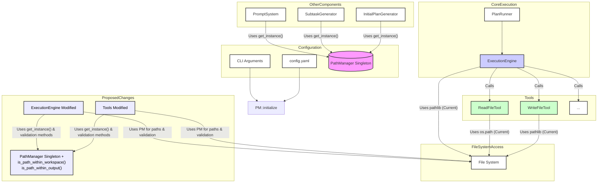

# Directory Restriction Strategy for AI Whisperer Runner

## 1. Introduction

This document outlines the strategy to implement robust directory restrictions for the AI Whisperer runner. Currently, the runner has the potential for overly broad file system access during plan execution. The primary goal of this strategy is to ensure that the runner can only read from a designated "workspace" directory and write to a designated "output" directory, with all path resolutions and validations managed centrally by the `PathManager`.

## 2. Current State Summary

An analysis of the existing system ([`docs/path_manager_analysis.md`](docs/path_manager_analysis.md)) reveals:

* The `PathManager` ([`src/ai_whisperer/path_management.py`](src/ai_whisperer/path_management.py)) is utilized by configuration-loading components ([`config.py`](src/ai_whisperer/config.py), [`cli.py`](src/ai_whisperer/cli.py)) and some generation-phase components ([`prompt_system.py`](src/ai_whisperer/prompt_system.py), [`subtask_generator.py`](src/ai_whisperer/subtask_generator.py), [`initial_plan_generator.py`](src/ai_whisperer/initial_plan_generator.py)) for resolving paths to prompts and schemas.
* However, the core execution components – `PlanRunner` ([`src/ai_whisperer/plan_runner.py`](src/ai_whisperer/plan_runner.py)) via its `ExecutionEngine` ([`src/ai_whisperer/execution_engine.py`](src/ai_whisperer/execution_engine.py)), and the file I/O tools (`ReadFileTool` ([`src/ai_whisperer/tools/read_file_tool.py`](src/ai_whisperer/tools/read_file_tool.py), `WriteFileTool` ([`src/ai_whisperer/tools/write_file_tool.py`](src/ai_whisperer/tools/write_file_tool.py))) – do not currently use `PathManager` for resolving or validating paths for task artifacts or subtask definition files. They perform direct path operations, often relative to the current working directory.

This lack of integration prevents centralized enforcement of file access policies.

## 3. Proposed Directory Restriction Strategy

The strategy involves enhancing `PathManager` and refactoring `ExecutionEngine` and file I/O tools to use it for all relevant path operations.

### 3.1. `PathManager` Enhancements ([`src/ai_whisperer/path_management.py`](src/ai_whisperer/path_management.py))

Two new methods will be added to `PathManager` to serve as the authoritative source for path validation:

* **`is_path_within_workspace(self, path_to_check: Union[str, Path]) -> bool`:**
  * Takes a file or directory path (string or `Path` object) as input.
  * Resolves `path_to_check` to an absolute, normalized path.
  * Verifies if this resolved path is a subpath of (or the same as) `self.workspace_path`.
  * Returns `True` if the path is within the defined workspace, `False` otherwise.

* **`is_path_within_output(self, path_to_check: Union[str, Path]) -> bool`:**
  * Takes a file or directory path (string or `Path` object) as input.
  * Resolves `path_to_check` to an absolute, normalized path.
  * Verifies if this resolved path is a subpath of (or the same as) `self.output_path`.
  * Returns `True` if the path is within the defined output directory, `False` otherwise.

### 3.2. `ExecutionEngine` Modifications ([`src/ai_whisperer/execution_engine.py`](src/ai_whisperer/execution_engine.py))

The `ExecutionEngine` will be modified as follows:

* **Integration:** It will obtain and use the `PathManager` singleton instance via `PathManager.get_instance()`.
* **Path Resolution:**
  * All resolutions for input artifact paths, output artifact paths, and paths to subtask definition files will be refactored.
  * Instead of direct `pathlib.Path(...).resolve()`, these operations will use `PathManager.get_instance().resolve_path(path_from_task_definition)` or construct paths by joining `PathManager.get_instance().workspace_path` or `PathManager.get_instance().output_path` with relative paths from task definitions.
* **Path Validation:**
  * Before any file read operation (e.g., for input artifacts, loading subtask definitions), the resolved absolute path will be validated using `PathManager.get_instance().is_path_within_workspace(resolved_path)`.
  * Before any file write operation (e.g., for output artifacts), the resolved absolute path will be validated using `PathManager.get_instance().is_path_within_output(resolved_path)`.
* **Error Handling:** If any path validation fails, the `ExecutionEngine` will raise an appropriate error (e.g., a new `SecurityError` or an existing `OrchestratorError`), causing the current task to fail and preventing the unauthorized file operation.

### 3.3. File Operation Tool Modifications (e.g., [`ReadFileTool`](src/ai_whisperer/tools/read_file_tool.py), [`WriteFileTool`](src/ai_whisperer/tools/write_file_tool.py))

File I/O tools will be refactored:

* **Integration:** Tools performing file I/O must be modified to obtain and use `PathManager.get_instance()`.
* **Path Resolution:**
  * Paths provided to tools will be resolved relative to the appropriate base directory defined in `PathManager`. For example, `ReadFileTool` will resolve paths against `PathManager.workspace_path`, and `WriteFileTool` against `PathManager.output_path`.
* **Path Validation:**
  * The existing basic path validation in `ReadFileTool` will be removed.
  * `ReadFileTool`: Before reading, it must validate the resolved path using `PathManager.is_path_within_workspace()`.
  * `WriteFileTool`: Before writing, it must validate the resolved path using `PathManager.is_path_within_output()`.
  * Any tool requiring write access to the `workspace_path` (which should be exceptional and require strong justification) must explicitly document this and use appropriate validation.
* **Error Handling:** If path validation fails within a tool, the tool will raise an error, which will be propagated up to the `ExecutionEngine`.

## 4. Visual Representation

The following diagram illustrates the shift from current direct file system access by execution components to a proposed model where `PathManager` mediates and validates these accesses.

## 5. Definitions

* **Workspace Directory (`workspace_path`):** This is the primary directory from which the runner is expected to read project source files, input artifacts for tasks, and subtask definition files. By default, operations within this directory should be treated as read-only by the runner during task execution, unless an operation is explicitly designed and validated to write to a specific, controlled sub-path within the workspace (e.g., a dedicated cache or temporary working area within the workspace, if deemed necessary and safe).
* **Output Directory (`output_path`):** This is the designated directory where all files generated by the runner as output artifacts of tasks must be written. The runner should have unrestricted write access *within* this directory but should not be able to write outside of it.

## 6. Benefits of the Strategy

Implementing this directory restriction strategy will yield several key benefits:

* **Enhanced Security:** Significantly reduces the risk of accidental or malicious file system operations outside of intended project boundaries. It prevents the runner from reading sensitive files elsewhere on the system or writing files to arbitrary locations.
* **Improved Predictability and Reliability:** Ensures that all file operations occur in known, configured locations, making the runner's behavior more consistent and easier to debug.
* **Centralized Control and Maintainability:** Consolidates path validation logic within `PathManager`, making it easier to manage, update, and audit file access policies across the application.

## 7. Conclusion

By systematically integrating `PathManager` into the `ExecutionEngine` and its associated file operation tools, and by equipping `PathManager` with robust validation methods, the AI Whisperer project will establish a strong, centralized mechanism for directory restriction. This will greatly enhance the security, safety, and predictability of plan execution, ensuring the runner operates strictly within its designated file system boundaries.
