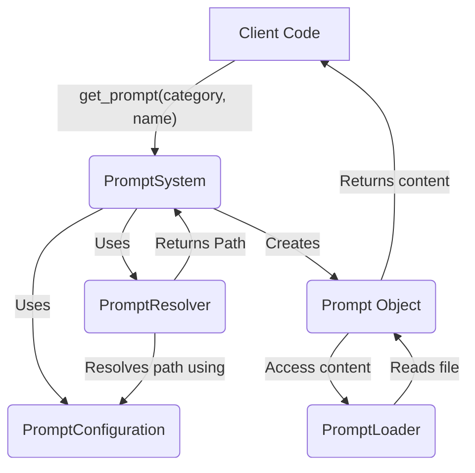

# New Prompt Loading System Design

## 1. Introduction

This document outlines the design for a new, refactored prompt loading system. The goal is to create a centralized, structured, and lazy-loaded system with clear override and fallback mechanisms, improving maintainability, flexibility, and scalability.

## 2. Goals

* **Centralization:** Consolidate prompt management into a single, well-defined service.
* **Structure:** Implement a clear and consistent directory structure and naming convention for prompts.
* **Lazy Loading:** Load prompt content only when it's actually needed to improve performance.
* **Clear Override & Fallback:** Define a transparent hierarchy for resolving prompt paths, allowing for easy customization and defaults.
* **Extensibility:** Design the system to accommodate future enhancements like prompt versioning, environment-specific variants, and advanced templating.

## 3. Core Components

The new system will be composed of the following key components:

### 3.1. `PromptSystem`

* **Responsibility:** The central service and primary interface for accessing prompts. It orchestrates the other components.
* **Functionality:**
  * Retrieves prompt objects or content based on identifiers (e.g., category, name).
  * Manages prompt configurations.
  * Handles lazy loading.

### 3.2. `Prompt`

* **Responsibility:** A data class or object representing a loaded prompt.
* **Attributes:**
  * `category: str` (e.g., "core", "agent", "custom")
  * `name: str` (e.g., "initial_plan", "code_generation")
  * `content: str` (The actual prompt text, loaded lazily)
  * `path: Path` (The resolved file path of the prompt)
  * `metadata: Dict` (Optional, for version, description, parameters, etc.)

### 3.3. `PromptResolver`

* **Responsibility:** Determines the correct file path for a requested prompt based on a defined resolution hierarchy and configuration.
* **Functionality:**
  * Takes prompt identifiers (category, name) as input.
  * Consults `PromptConfiguration` and checks predefined directories.
  * Returns the resolved `Path` object or raises an error if not found.

### 3.4. `PromptLoader`

* **Responsibility:** Handles the actual reading of prompt content from a file.
* **Functionality:**
  * Takes a file `Path` as input.
  * Reads and returns the file content.
  * Implements lazy loading; content is read only when explicitly requested (e.g., when `Prompt.content` is accessed).

### 3.5. `PromptConfiguration`

* **Responsibility:** Manages the configuration for the prompt system.
* **Functionality:**
  * Loads settings from a configuration source (e.g., YAML file, environment variables).
  * Provides information about custom prompt paths, default locations, and other settings.
  * Allows users to override default prompt locations or define new prompts.

## 4. Directory Structure and Naming Convention

A standardized directory structure will be adopted for storing prompts:

```text
prompts/
├── core/                     # Core system prompts
│   ├── initial_plan.prompt.md
│   └── subtask_generator.prompt.md
├── agents/                   # Prompts specific to agent types
│   ├── code_generation.prompt.md
│   └── planning_agent.prompt.md
├── custom/                   # User-defined or project-specific overrides/additions
│   ├── core/
│   │   └── initial_plan.override.prompt.md # Example override
│   └── my_feature/
│       └── special_task.prompt.md
└── _templates/               # (Future) For prompt templates or partials
```

**Naming Convention:**

* Files will generally follow `[name].prompt.md`.
* Categories will be represented by subdirectories (e.g., `core`, `agents`).
* Overrides might use a suffix like `.override.prompt.md` or be handled purely by path in configuration.

## 5. Prompt Resolution Hierarchy

The `PromptResolver` will use the following order to find a prompt:

1. **User-Defined Path (via `PromptConfiguration`):** A direct path specified in the system's configuration (e.g., a YAML file) for a given `category` and `name`. This allows for complete override.
2. **Custom Directory:** `prompts/custom/[category]/[name].prompt.md` (or a configurable custom base path).
3. **Agent-Specific Directory (if applicable):** `prompts/agents/[name].prompt.md` (assuming `category` implies an agent type).
4. **Core Directory:** `prompts/core/[name].prompt.md` (for core system prompts).
5. **Built-in Default:** A fallback to a default prompt packaged with the application or defined in code, if no file is found.

## 6. `PromptSystem` API (Conceptual)

```python
class PromptSystem:
    def __init__(self, configuration: PromptConfiguration):
        # ...
        pass

    def get_prompt(self, category: str, name: str) -> Prompt:
        """
        Retrieves a Prompt object, with content loaded lazily.
        Raises PromptNotFoundError if not found after checking hierarchy.
        """
        # ...
        pass

    def get_prompt_content(self, category: str, name: str, **kwargs) -> str:
        """
        Retrieves the processed content of a prompt.
        Handles parameter injection if templating is supported.
        Raises PromptNotFoundError.
        """
        # ...
        pass

    def list_prompts(self, category: Optional[str] = None) -> List[Tuple[str, str]]:
        """
        Lists available prompts, optionally filtered by category.
        Returns a list of (category, name) tuples.
        """
        # ...
        pass

class PromptNotFoundError(Exception):
    pass
```

## 7. Lazy Loading Mechanism

* The `PromptSystem.get_prompt()` method will return a `Prompt` object where the `content` attribute is not immediately populated.
* The `PromptLoader` will be responsible for this. The `Prompt` object might have a method like `load_content()` or its `content` property could trigger loading on first access.
* This ensures that file I/O only occurs when the prompt's text is actually required.

## 8. Configuration

* A dedicated configuration file (e.g., `prompts.yaml` or a section in the main `config.yaml`) will be used.
* **Example `prompts.yaml`:**

    ```yaml
    prompt_settings:
      base_paths:
        custom: "project_prompts/" # Override default custom path
      overrides:
        core.initial_plan: "prompts/custom/my_initial_plan.prompt.md"
      definitions: # For defining new, non-standard prompts
        my_custom_category.new_utility_prompt: "path/to/new_utility.md"
    ```

## 9. Component Interaction Diagram



## 10. Future Considerations

* **Prompt Versioning:**
  * Extend naming convention: `[name].[version].prompt.md`.
  * Add `version` parameter to `PromptSystem.get_prompt()`.
  * Configuration to specify default versions or resolve version constraints.
* **Environment-Specific Variants:**
  * Subdirectories like `prompts/core/dev/` or `prompts/core/prod/`.
  * `PromptResolver` to check for environment-specific versions based on current runtime environment.
* **Dynamic Parameter Injection & Templating:**
  * Integrate a templating engine (e.g., Jinja2).
  * `Prompt.content` or a dedicated method would handle rendering with provided context.
  * Metadata in `Prompt` object could define expected parameters.
* **Error Handling:** Define specific exceptions for "prompt not found," "parsing error," etc.

## 11. Conclusion

This design provides a robust and flexible foundation for managing prompts within the application. It addresses current needs while being adaptable for future growth and complexity.
