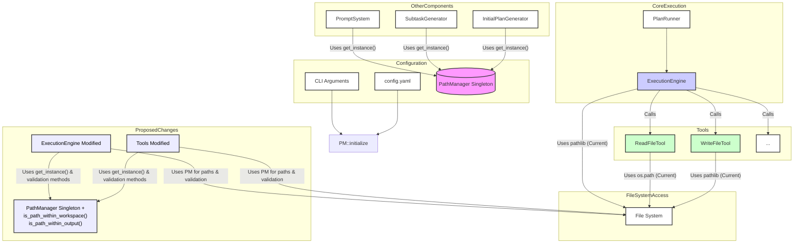

# Path Manager Usage Analysis for Directory Restriction

## 1. Introduction

This document analyzes how the `PathManager` is currently utilized within the AI Whisperer project, specifically focusing on its interaction (or lack thereof) with the `PlanRunner` and `ExecutionEngine` components. The goal is to identify areas that require modification to implement robust directory restrictions for file operations performed during plan execution. This will ensure that the runner only reads from and writes to designated, permitted directories.

## 2. Current `PathManager` Usage

The `PathManager` ([`src/ai_whisperer/path_management.py`](src/ai_whisperer/path_management.py:4)) is implemented as a singleton. Its primary responsibilities include:

* **Initialization:** It is initialized in [`config.py`](src/ai_whisperer/config.py:103) using values from the application's configuration file (`config.yaml`) and command-line arguments. This process sets up key base paths such as `project_path`, `workspace_path`, `output_path`, `prompt_path`, and `app_path`.
* **Path Resolution:** It provides a `resolve_path(template_string)` method (line 116) to resolve path strings containing placeholders (e.g., `{project_path}`, `{app_path}`).
* **Access:** Other components access the `PathManager` instance via `PathManager.get_instance()`.

Currently, `PathManager` is primarily used by:

* **[`config.py`](src/ai_whisperer/config.py):** Initializes the `PathManager` instance.
* **[`cli.py`](src/ai_whisperer/cli.py):** Defines CLI arguments that can override `PathManager` settings, which are then used during its initialization.
* **[`prompt_system.py`](src/ai_whisperer/prompt_system.py):** Uses `PathManager.get_instance()` to determine `prompt_path` and `app_path` for loading prompt template files (e.g., lines 73, 74).
* **[`subtask_generator.py`](src/ai_whisperer/subtask_generator.py):** Uses `PathManager.get_instance().resolve_path()` to locate JSON schema files (e.g., line 87).
* **[`initial_plan_generator.py`](src/ai_whisperer/initial_plan_generator.py):** Uses `PathManager.get_instance().resolve_path()` to locate JSON schema files (e.g., line 63).

## 3. Runner and `ExecutionEngine` Path Handling

* The [`PlanRunner`](src/ai_whisperer/plan_runner.py) is responsible for the overall execution of a parsed plan. It instantiates and delegates the actual task-by-task execution to the `ExecutionEngine` ([`src/ai_whisperer/plan_runner.py`](src/ai_whisperer/plan_runner.py:149)).
* The [`ExecutionEngine`](src/ai_whisperer/execution_engine.py) handles the logic for individual tasks, including reading input artifacts, writing output artifacts, and loading subtask definitions from files.
* Crucially, the `ExecutionEngine` **does not currently use `PathManager`**. Instead, it performs path resolutions directly using `pathlib.Path` methods, often resolving paths relative to the current working directory or using paths as specified in task definitions.
  * Example (Input Artifacts): `Path(artifact).resolve()` ([`src/ai_whisperer/execution_engine.py`](src/ai_whisperer/execution_engine.py:182))
  * Example (Output Artifacts): `Path(output_artifact_path_str).resolve()` ([`src/ai_whisperer/execution_engine.py`](src/ai_whisperer/execution_engine.py:466))
  * Example (Subtask Files): `Path(file_path).resolve()` ([`src/ai_whisperer/execution_engine.py`](src/ai_whisperer/execution_engine.py:720))

## 4. File Operation Tools Path Handling

The `ExecutionEngine` utilizes tools for specific file operations. The primary tools for file I/O are `ReadFileTool` and `WriteFileTool`.

* **[`ReadFileTool`](src/ai_whisperer/tools/read_file_tool.py):**
  * Does not use `PathManager`.
  * Assumes input `file_path` is relative to the current working directory (`os.path.abspath('.')`) ([`src/ai_whisperer/tools/read_file_tool.py`](src/ai_whisperer/tools/read_file_tool.py:41)).
  * Performs a basic check to prevent reading outside this "project directory": `os.path.abspath(abs_file_path).startswith(project_dir)` ([`src/ai_whisperer/tools/read_file_tool.py`](src/ai_whisperer/tools/read_file_tool.py:51)). This `project_dir` may not align with `PathManager`'s configured paths.
* **[`WriteFileTool`](src/ai_whisperer/tools/write_file_tool.py):**
  * Does not use `PathManager`.
  * Uses `pathlib.Path` for its operations (e.g., `pathlib.Path(file_path).parent` on line 51).
  * It creates parent directories if they don't exist ([`src/ai_whisperer/tools/write_file_tool.py`](src/ai_whisperer/tools/write_file_tool.py:53)).
  * Currently lacks explicit checks to ensure writes occur only within a designated project or workspace directory.

## 5. Key Findings Summary

1. The `PathManager` provides a centralized way to manage key application and project paths based on configuration and CLI arguments.
2. Components involved in the setup and generation phases (config loading, prompt loading, schema loading) correctly utilize `PathManager`.
3. The core components responsible for plan execution (`PlanRunner` via `ExecutionEngine`) and the file I/O tools (`ReadFileTool`, `WriteFileTool`) **do not currently use `PathManager`** for resolving paths related to task artifacts, subtask files, or general file access during execution.
4. This lack of integration means that any directory restriction logic needs to be newly introduced into `ExecutionEngine` and the tools, and they must be refactored to leverage `PathManager`.

## 6. Proposed Areas for Modification

To implement robust directory restrictions for the runner, the following modifications are proposed:

**1. `ExecutionEngine` ([`src/ai_whisperer/execution_engine.py`](src/ai_whisperer/execution_engine.py))**

* **Integration with `PathManager`:**
  * The `ExecutionEngine` should retrieve the `PathManager` instance using `PathManager.get_instance()` whenever path-related configurations or resolution is needed.
* **Path Resolution:**
  * All path resolutions for input artifacts, output artifacts, and subtask definition files must be changed. Instead of direct `pathlib.Path(...).resolve()`, they should use `PathManager.get_instance().resolve_path(path_from_task_definition)` or construct paths relative to `PathManager.get_instance().workspace_path` or `PathManager.get_instance().output_path` as appropriate.
* **Path Validation:**
  * Before any file read or write operation, the `ExecutionEngine` must validate that the target absolute path falls within the permitted directories. This will be done using the new mandatory methods in `PathManager` (see section 6.3).
    * For reading inputs (artifacts, subtask definitions): Use `PathManager.get_instance().is_path_within_workspace(resolved_path)`.
    * For writing outputs (artifacts): Use `PathManager.get_instance().is_path_within_output(resolved_path)`.
  * If validation fails, an appropriate error (e.g., `OrchestratorError` or a new `SecurityError`) should be raised, and the task should fail.

**2. File Operation Tools (e.g., [`ReadFileTool`](src/ai_whisperer/tools/read_file_tool.py), [`WriteFileTool`](src/ai_whisperer/tools/write_file_tool.py))**

* **Integration with `PathManager`:**
  * Tools performing file I/O must be refactored to use `PathManager.get_instance()` to resolve provided file paths against the appropriate base directory (e.g., `workspace_path` for reads, `output_path` for writes).
* **Path Validation:**
  * The existing path validation logic in `ReadFileTool` must be replaced.
  * Both `ReadFileTool` and `WriteFileTool` (and any other tools performing file I/O) must use the new `PathManager.is_path_within_workspace()` and `PathManager.is_path_within_output()` methods to ensure operations are confined to permitted directories.
  * `ReadFileTool`: Validate against `is_path_within_workspace()`.
  * `WriteFileTool`: Validate against `is_path_within_output()`. (If a tool needs to write to the workspace, this needs careful consideration and clear justification).
  * Return an error if validation fails.

**3. `PathManager` ([`src/ai_whisperer/path_management.py`](src/ai_whisperer/path_management.py)) (Mandatory Enhancements)**

* **`is_path_within_workspace(self, path_to_check: Union[str, Path]) -> bool`:**
  * This new method must be added.
  * It will take a path (string or `Path` object) as input.
  * It will resolve `path_to_check` to an absolute, normalized path.
  * It will then verify if this resolved path is a subpath of (or the same as) `self.workspace_path`.
  * Returns `True` if within bounds, `False` otherwise.
* **`is_path_within_output(self, path_to_check: Union[str, Path]) -> bool`:**
  * This new method must be added.
  * Similar to `is_path_within_workspace`, but checks against `self.output_path`.
  * Returns `True` if within bounds, `False` otherwise.
* These methods will serve as the centralized authority for validating path safety for runner operations.

## 7. Diagram: Current vs. Proposed Path Handling

## 8. Conclusion

By integrating `PathManager` into the `ExecutionEngine` and file operation tools, and by enhancing `PathManager` with explicit path validation methods, the AI Whisperer project can achieve robust and centralized directory restrictions. This will significantly improve the security and predictability of file operations performed during plan execution, ensuring the runner operates within its designated boundaries.
