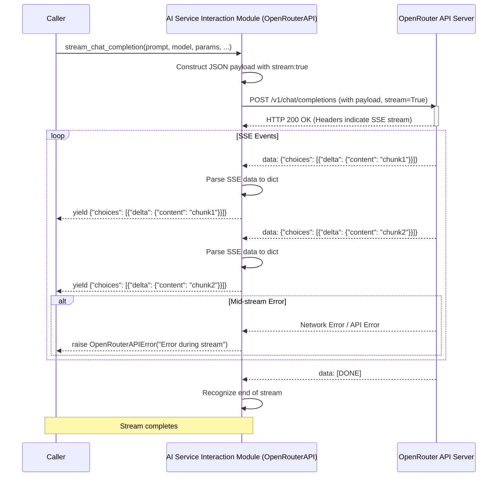

# AI Service Interaction Module Design

## 1. Overview

This document outlines the design for enhancing the AI Service Interaction Module, specifically focusing on integrating streaming capabilities for OpenRouter within the existing `AIWhisperer` runner. The primary goal is to enable the runner to send prompts to OpenRouter and process AI-generated responses as a stream of data.

This module will extend the current [`src/ai_whisperer/openrouter_api.py`](src/ai_whisperer/openrouter_api.py) to include this new functionality.

## 2. Module Responsibilities and API

The AI Service Interaction Module, embodied by the `OpenRouterAPI` class in [`src/ai_whisperer/openrouter_api.py`](src/ai_whisperer/openrouter_api.py:14), will be responsible for:

* Authenticating with the OpenRouter API.
* Formatting requests for both standard and streaming chat completions.
* Sending requests to the OpenRouter API.
* Parsing non-streaming responses.
* Parsing and yielding streaming responses chunk by chunk.
* Handling API errors gracefully.
* Integrating with the application's configuration for API keys, model selection, and other parameters.

### 2.1. API Changes (Extending `OpenRouterAPI`)

The existing `OpenRouterAPI` class will be augmented with a new public method for streaming chat completions.

#### 2.1.1. New Method: `stream_chat_completion`

* **Signature:**

    ```python
    def stream_chat_completion(
        self,
        prompt_text: str,
        model: str,
        params: Dict[str, Any],
        system_prompt: str = None,
        tools: List[Dict[str, Any]] = None,
        response_format: Dict[str, Any] = None,
        images: List[str] = None, # If supported by model and OpenRouter streaming
        pdfs: List[str] = None,   # If supported by model and OpenRouter streaming
        messages_history: List[Dict[str, Any]] = None
    ) -> Generator[Dict[str, Any], None, None]:
    ```

* **Description:** Initiates a streaming chat completion request to the OpenRouter API. It sends the prompt and parameters, then yields parsed data chunks as they are received from the API.
* **Arguments:** Similar to the existing `call_chat_completion` method.
  * `prompt_text`: The user's primary text prompt.
  * `model`: The model identifier.
  * `params`: API parameters (e.g., temperature).
  * `system_prompt`: Optional system message.
  * `tools`: Optional list of tool definitions.
  * `response_format`: Optional specification for structured output.
  * `images`: Optional list of image data (ensure OpenRouter streaming supports this).
  * `pdfs`: Optional list of PDF data (ensure OpenRouter streaming supports this).
  * `messages_history`: Optional list of previous messages to continue a conversation.
* **Yields:** Dictionaries representing parsed Server-Sent Event (SSE) data chunks. Typically, these will be the JSON object provided in the `data:` field of an SSE message from OpenRouter, often containing a `delta` for the content or tool calls. Example: `{"choices": [{"delta": {"role": "assistant", "content": " new text"}}]}`, or `{"choices": [{"delta": {"tool_calls": [...]}}]}`.
* **Raises:**
  * [`OpenRouterAuthError`](src/ai_whisperer/openrouter_api.py:5): For authentication failures.
  * [`OpenRouterRateLimitError`](src/ai_whisperer/openrouter_api.py:6): If rate limits are exceeded.
  * [`OpenRouterConnectionError`](src/ai_whisperer/openrouter_api.py:7): For network issues.
  * [`OpenRouterAPIError`](src/ai_whisperer/openrouter_api.py:4) (or a new `OpenRouterStreamingError` subclass): For other API errors, including those occurring mid-stream.
  * [`ConfigError`](src/ai_whisperer/exceptions.py): For configuration-related issues.

## 3. Interaction with OpenRouter

### 3.1. Authentication

Authentication will continue to use the `OPENROUTER_API_KEY` environment variable, managed by the [`src/ai_whisperer/config.py`](src/ai_whisperer/config.py) and passed to the `OpenRouterAPI` constructor. The API key will be included in the `Authorization: Bearer <key>` header for all requests.

### 3.2. Request Structure

The `stream_chat_completion` method will construct a JSON payload similar to `call_chat_completion`. The key difference will be the inclusion of the `stream: true` parameter in the payload.

**Example Payload Snippet:**

```json
{
  "model": "mistralai/mistral-7b-instruct",
  "messages": [
    {"role": "system", "content": "You are a helpful assistant."},
    {"role": "user", "content": "Tell me a joke."}
  ],
  "temperature": 0.7,
  "stream": true
}
```

### 3.3. Response Handling (Streaming)

* The `requests` library will be used with `stream=True` in the `post` call.
* The method will iterate over the response content using `response.iter_lines()`.
* Each line will be processed to identify SSE fields (e.g., `data:`, `event:`).
* Lines starting with `data:` will have their content (a JSON string) parsed into a Python dictionary.
* These parsed dictionaries will be yielded by the generator.
* The stream typically ends when OpenRouter sends a `data: [DONE]` message or the connection is closed. The `[DONE]` message itself will not be yielded as a data object unless it's part of a standard data payload.

### 3.4. Sequence Diagram for Streaming Call



## 4. Integration with Existing Configuration

The `OpenRouterAPI` class's existing integration with [`src/ai_whisperer/config.py`](src/ai_whisperer/config.py) will be maintained.

* The constructor `__init__(self, config: Dict[str, Any])` will continue to receive the `openrouter` section of the application configuration.
* This `config` dictionary provides the API key (already resolved from `OPENROUTER_API_KEY` by `load_config`), default model, `site_url`, `app_name`, `cache` settings, and `timeout_seconds`.
* The `stream_chat_completion` method will utilize these configured values (e.g., API key for headers, timeout for the initial request).
* Task-specific model configurations loaded by [`config.py`](src/ai_whisperer/config.py) will be usable by the caller to determine which `model` and `params` to pass to `stream_chat_completion`.

## 5. Error Handling

* **Initial Request Errors:** Errors occurring before the stream is established (e.g., invalid API key, model not found, connection timeout during POST) will raise exceptions like [`OpenRouterAuthError`](src/ai_whisperer/openrouter_api.py:5), [`OpenRouterAPIError`](src/ai_whisperer/openrouter_api.py:4), or [`OpenRouterConnectionError`](src/ai_whisperer/openrouter_api.py:7) from within the `stream_chat_completion` method before it yields anything.
* **Mid-Stream Errors:** If an error occurs after the stream has started (e.g., network interruption, OpenRouter sends an error event mid-stream), the `stream_chat_completion` generator will immediately raise an appropriate exception (e.g., [`OpenRouterAPIError`](src/ai_whisperer/openrouter_api.py:4) or a more specific `OpenRouterStreamingError` if introduced). The exception message should include details from the API if available.
* **Configuration Errors:** Invalid or missing configuration will lead to a [`ConfigError`](src/ai_whisperer/exceptions.py) during `OpenRouterAPI` instantiation or when `load_config` is called.

## 6. Key Data Structures

* **Input to `stream_chat_completion`:**
  * `messages_history: List[Dict[str, Any]]` (e.g., `[{"role": "user", "content": "Hello"}, {"role": "assistant", "content": "Hi there!"}]`)
  * `params: Dict[str, Any]` (e.g., `{"temperature": 0.5, "max_tokens": 100}`)
* **Yielded by `stream_chat_completion` (Generator Output):**
  * `Dict[str, Any]`: Parsed JSON object from an SSE `data:` field.
    * Example for content delta: `{"id":"chatcmpl-xxx","object":"chat.completion.chunk","created":1677652288,"model":"mistralai/mistral-7b-instruct","choices":[{"index":0,"delta":{"role":"assistant","content":" new text"},"finish_reason":null}]}`
    * Example for tool call delta (if applicable and supported by OpenRouter streaming): `{"id":"chatcmpl-yyy", ..., "choices":[{"index":0,"delta":{"tool_calls": [...]}, ...}]}`
* **Internal Data Structures for SSE Parsing:**
  * Strings for individual lines from `response.iter_lines()`.
  * Logic to strip `data:` prefix and handle multi-line data if OpenRouter ever sends it (though typically one JSON object per `data:` line).

## 7. Considerations & Future Work (Out of Scope for this Subtask)

* **`OpenRouterStreamingError`:** Consider creating a dedicated exception class for errors specific to the streaming process, inheriting from [`OpenRouterAPIError`](src/ai_whisperer/openrouter_api.py:4).
* **Timeout Handling for Streams:** The `timeout_seconds` from config applies to the initial connection. For long-lived streams, consider if read timeouts on `iter_lines` are necessary or if the stream should be allowed to run indefinitely until closed by the server or an error. For now, rely on `requests` default behavior for iterating over the stream content.
* **Caching for Streaming Responses:** Caching streaming responses is complex and generally not done. The existing caching mechanism in `OpenRouterAPI` applies to non-streaming calls and will not be applied to `stream_chat_completion`.
* **Support for other AI Providers:** This design focuses on OpenRouter. Future work might involve creating a more generic AI service interface.
* **Detailed handling of different `event:` types in SSE:** While `data:` is primary, other event types might be used by OpenRouter in the future. The current design focuses on parsing `data:`.

## 8. Testing Strategy (High-Level)

* Unit tests for the `stream_chat_completion` method:
  * Mock `requests.post` to simulate successful streaming responses with various data chunks.
  * Mock `requests.post` to simulate API errors before streaming starts.
  * Mock `requests.post` to simulate errors occurring mid-stream.
  * Verify correct parsing of SSE data.
  * Verify correct yielding of dictionary objects.
* Integration tests (if feasible with a test API key or VCR-like tool) to ensure actual interaction with OpenRouter streaming works as expected.

This design aims to fulfill the requirements of the subtask by providing a clear plan for implementing streaming chat completions with OpenRouter.
