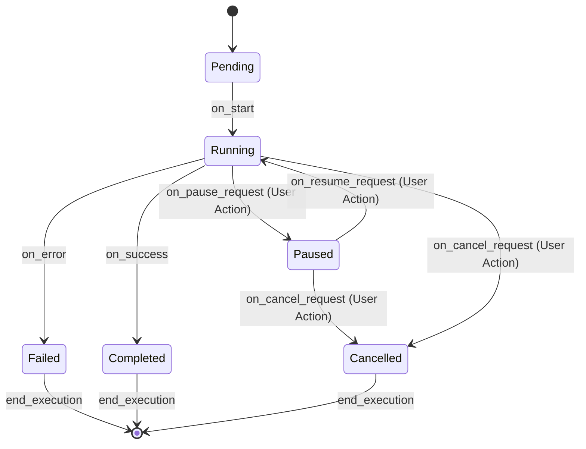

# Logging and Monitoring Design for AIWhisperer Runner

## 0. Introduction and Goals

### 0.1. Feature Description
The Logging and Monitoring feature is a crucial component of the AIWhisperer Runner. Its primary purpose is to provide detailed and structured logging of all actions performed by the runner. This includes, but is not limited to, the execution of plan steps, interactions with AI services (API calls), file system operations (reads, writes, creations, deletions), and the execution of terminal commands.

The system will meticulously log successes, failures, and any other significant events that occur during the runner's operation. This comprehensive logging is essential for both real-time monitoring of plan execution progress and for post-execution analysis and debugging.

A key aspect of this feature is its ability to reflect the potentially complex nature of individual steps, which may involve multiple interactions with AI services or other sub-actions. The monitoring view will provide a running commentary of these interactions across all actions performed by the AI driving the plan.

Furthermore, the system will empower users with interactive capabilities, allowing them to pause, cancel, or add extra context to the execution process as the AI works. Initially, this will be facilitated through a simple, yet effective, terminal-based interface. However, the design will be forward-looking, ensuring that the underlying logging and state management systems are robust and flexible enough to support more advanced graphical user interfaces (GUIs) in the future.

### 0.2. Core Objectives
Based on the feature description, the core objectives of this design are:
1.  **Comprehensive Logging:** Capture detailed information about all runner activities.
2.  **Real-time Monitoring:** Provide users with a clear view of the current execution status and recent activities.
3.  **User Interaction Support:** Enable users to interact with the running plan (pause, resume, cancel, add context).
4.  **Debuggability:** Facilitate easier debugging and issue resolution through detailed logs.
5.  **Extensibility:** Design a system that can be enhanced with more sophisticated UIs and monitoring capabilities in the future.
6.  **Clarity:** Ensure developers can understand what is happening within the runner as it executes tasks.

### 0.3. User Stories
The following user stories drive the design of this feature:
*   As a developer, I want the runner to log all actions so that I can monitor progress and debug issues.
*   As a developer, I want the runner to provide a way to monitor execution so that I can track the status of long-running plans.
*   As a developer, I want the runner to help me understand what is happening as it happens.

## 1. System Architecture

### Visual Overview

*(Note: The actual `logging_architecture.png` file would need to be created and placed in an accessible path, e.g., a `docs/images/` directory relative to the markdown file, or use an absolute path/URL if hosted elsewhere. For this document, it's a placeholder.)*

### Mermaid Diagram: System Flow
```mermaid
graph TD
    subgraph "Input: Event Sources"
        A[Execution Engine] -- "Step Events (start, end, error)" --> L{Log Processor}
        B[AI Service Interaction] -- "API Calls (request, response, error)" --> L
        C[File Operations Module] -- "File Actions (read, write, delete)" --> L
        D[Terminal Interaction Module] -- "Command Execution (cmd, stdout, stderr, exit_code)" --> L
        E[User Interface/Controller] -- "User Actions (pause, resume, cancel, add_context)" --> L
    end

    subgraph "Processing: Core Logging System"
        L -- "Raw Log Data" --> C1[Event Formatter & Enricher]
        C1 -- "Structured LogMessage" --> C2[State Tracker]
        C1 -- "Formatted LogMessage" --> C3[Log Dispatcher]
    end

    subgraph "Output: Log Destinations & Monitoring"
        C2 -- "Current State" --> M1[Terminal Monitor]
        C3 -- "Filtered Logs" --> M1
        C3 -- "All Logs" --> F1[Log File (JSON/Text)]
        C3 -- "Metrics/Alerts (Future)" --> M2[External Monitoring System]
    end

    M1 -- "Displays Info To" --> U[User]
```

## 2. State Management

### State Transition Diagram (Overall Plan & Individual Steps)
This diagram illustrates the lifecycle of a plan or an individual step within the runner.


## 3. Core Logging System Design

### 3.1. Log Message Structure (`LogMessage` dataclass)
A structured log message is key to enabling effective parsing, filtering, and analysis.
```python
import logging
from dataclasses import dataclass, field
from enum import Enum
from typing import Dict, Any, Optional
from datetime import datetime

# Rich for terminal output
from rich.console import Console
from rich.logging import RichHandler

class LogLevel(Enum):
    DEBUG = "DEBUG"    # Detailed information, typically of interest only when diagnosing problems.
    INFO = "INFO"      # Confirmation that things are working as expected.
    WARNING = "WARNING"  # An indication that something unexpected happened, or indicative of some problem in the near future.
    ERROR = "ERROR"    # Due to a more serious problem, the software has not been able to perform some function.
    CRITICAL = "CRITICAL" # A serious error, indicating that the program itself may be unable to continue running.

class ComponentType(Enum):
    RUNNER = "runner" # Overall runner operations, lifecycle events.
    EXECUTION_ENGINE = "execution_engine" # Orchestration and execution of plan steps.
    AI_SERVICE = "ai_service" # Interactions with AI models (e.g., OpenAI, local LLMs).
    FILE_OPERATIONS = "file_operations" # Reading, writing, or modifying files.
    TERMINAL_INTERACTION = "terminal_interaction" # Executing shell commands.
    STATE_MANAGEMENT = "state_management" # Changes to the runner's internal state.
    USER_INTERACTION = "user_interaction" # Actions initiated directly by the user (pause, cancel, etc.).

@dataclass
class LogMessage:
    timestamp: str = field(default_factory=lambda: datetime.utcnow().isoformat(timespec='milliseconds') + "Z")
    level: LogLevel
    component: ComponentType
    action: str  # Verb describing the event, e.g., "step_started", "api_request_sent", "user_paused_execution"
    message: str  # Human-readable summary of the event.
    step_id: Optional[str] = None # ID of the current plan step, if applicable.
    event_id: Optional[str] = None # Unique ID for this specific log event, useful for tracing.
    state_before: Optional[str] = None # The state of the relevant entity (e.g., step, plan) before this action.
    state_after: Optional[str] = None # The state of the relevant entity after this action.
    duration_ms: Optional[float] = None # Duration of the action in milliseconds, if applicable.
    details: Dict[str, Any] = field(default_factory=dict) # Component-specific structured data providing context.
```

### 3.2. Logging Configuration (`logging_config.yaml`)
Centralized configuration allows for flexible control over logging behavior without code changes.
Logging will be configurable via a YAML file (e.g., `logging_config.yaml`) or environment variables, controlling:
*   Default log level (e.g., `INFO`).
*   Log level per component (e.g., `AI_SERVICE: DEBUG`).
*   Log output destinations (e.g., console, file).
*   Log file path, rotation policy (size/time-based), and format (structured JSON or human-readable text).
*   Console output format, including Rich library specific formatting options.

Example (`logging_config.yaml`):
```yaml
version: 1
disable_existing_loggers: False # Important to not disable other loggers

formatters:
  simple_console:
    format: '%(message)s' # RichHandler will add its own timestamp and level
  detailed_file:
    format: '%(asctime)s.%(msecs)03dZ - %(levelname)-8s - [%(name)s:%(module)s:%(funcName)s:%(lineno)d] - %(message)s'
    datefmt: '%Y-%m-%dT%H:%M:%S'
  json_file:
    class: pythonjsonlogger.jsonlogger.JsonFormatter
    format: '%(asctime)s %(levelname)s %(name)s %(module)s %(funcName)s %(lineno)d %(message)s %(step_id)s %(event_id)s %(component)s %(action)s'
    # Ensure custom fields from LogMessage are passed via extra={}

handlers:
  console_rich:
    class: rich.logging.RichHandler
    level: INFO
    formatter: simple_console # Rich handles its own formatting for level and time
    rich_tracebacks: True
    show_path: False # Can be noisy
    markup: True
  file_rotating_text:
    class: logging.handlers.RotatingFileHandler
    level: DEBUG
    formatter: detailed_file
    filename: aiwhisperer_runner.log
    maxBytes: 10485760 # 10MB
    backupCount: 5
    encoding: utf-8
  file_rotating_json:
    class: logging.handlers.RotatingFileHandler
    level: DEBUG
    formatter: json_file # Requires passing 'extra' in logging calls
    filename: aiwhisperer_runner.json.log
    maxBytes: 10485760 # 10MB
    backupCount: 5
    encoding: utf-8

root:
  level: DEBUG # Capture all, handlers will filter
  handlers: [console_rich, file_rotating_text, file_rotating_json]

loggers:
  # Example of component-specific level override
  ai_service_logger: # Corresponds to logger name used in code
    level: DEBUG
    handlers: [console_rich, file_rotating_text, file_rotating_json] # Or specific handlers
    propagate: False # Prevent double logging if root also handles
  # other specific loggers...
```
*Note: For JSON logging with custom fields, logger calls would need to pass `extra=log_message_instance.to_dict()` or similar.*

## 4. Detailed Log Event Examples
These examples illustrate the structure and content of log messages for various runner activities.

### a. Plan Step Execution
```python
# Step Start
LogMessage(
    level=LogLevel.INFO, component=ComponentType.EXECUTION_ENGINE, action="step_execution_started",
    message="Starting execution of step 'generate_initial_code'.", step_id="generate_initial_code_step_001",
    state_before="Pending", state_after="Running",
    details={"step_type": "code_generation", "description": "Generate Python function for data processing."}
)

# Step Success
LogMessage(
    level=LogLevel.INFO, component=ComponentType.EXECUTION_ENGINE, action="step_execution_succeeded",
    message="Step 'generate_initial_code' completed successfully.", step_id="generate_initial_code_step_001",
    state_before="Running", state_after="Completed", duration_ms=2530.7,
    details={"output_artifact_count": 1, "generated_files": ["src/data_processor.py"]}
)

# Step Failure
LogMessage(
    level=LogLevel.ERROR, component=ComponentType.EXECUTION_ENGINE, action="step_execution_failed",
    message="Step 'run_unit_tests' failed due to assertion error.", step_id="run_unit_tests_step_002",
    state_before="Running", state_after="Failed", duration_ms=875.2,
    details={"error_type": "AssertionError", "error_message": "Test case 'test_empty_input' failed: Expected True, got False.", "traceback_summary": "File \"test_processor.py\", line 42, in test_empty_input..."}
)
```

### b. AI Service Calls (Illustrating multiple interactions within a step)
```python
# AI Request within 'generate_initial_code_step_001'
LogMessage(
    level=LogLevel.DEBUG, component=ComponentType.AI_SERVICE, action="api_request_sent",
    message="Sent request to LLM for code generation.", step_id="generate_initial_code_step_001", event_id="ai_call_001_req",
    details={"api_provider": "OpenAI", "model_used": "gpt-4-turbo", "request_payload_summary": {"prompt_tokens": 1200, "max_new_tokens": 1000}}
)

# AI Response Success for 'ai_call_001_req'
LogMessage(
    level=LogLevel.DEBUG, component=ComponentType.AI_SERVICE, action="api_response_received",
    message="Received successful response from LLM.", step_id="generate_initial_code_step_001", event_id="ai_call_001_resp", duration_ms=1850.0,
    details={"api_provider": "OpenAI", "status_code": 200, "response_payload_summary": {"completion_tokens": 850, "total_tokens": 2050}}
)

# Second AI Request (e.g., for refinement) within the same step
LogMessage(
    level=LogLevel.DEBUG, component=ComponentType.AI_SERVICE, action="api_request_sent",
    message="Sent request to LLM for code refinement.", step_id="generate_initial_code_step_001", event_id="ai_call_002_req",
    details={"api_provider": "OpenAI", "model_used": "gpt-4", "request_payload_summary": {"prompt_tokens": 950, "max_new_tokens": 500}}
)

# AI Response Error for 'ai_call_002_req'
LogMessage(
    level=LogLevel.WARNING, component=ComponentType.AI_SERVICE, action="api_response_failed",
    message="Failed API call to LLM for refinement due to rate limit.", step_id="generate_initial_code_step_001", event_id="ai_call_002_resp", duration_ms=420.0,
    details={"api_provider": "OpenAI", "status_code": 429, "error_type": "RateLimitError", "error_message": "API rate limit exceeded. Please try again later."}
)
```

### c. File Operations
```python
LogMessage(
    level=LogLevel.DEBUG, component=ComponentType.FILE_OPERATIONS, action="file_written",
    message="Successfully wrote generated code to 'src/data_processor.py'.", step_id="generate_initial_code_step_001",
    details={"file_path": "d:/Projects/AIWhisperer/src/data_processor.py", "bytes_written": 4096, "overwrite": False}
)

LogMessage(
    level=LogLevel.DEBUG, component=ComponentType.FILE_OPERATIONS, action="file_read_failed",
    message="Failed to read configuration file 'config/non_existent.yaml'.", step_id="load_config_step_000",
    details={"file_path": "d:/Projects/AIWhisperer/config/non_existent.yaml", "error_type": "FileNotFoundError"}
)
```

### d. Terminal Command Execution
```python
LogMessage(
    level=LogLevel.INFO, component=ComponentType.TERMINAL_INTERACTION, action="command_execution_started",
    message="Executing command: 'pytest -v'.", step_id="run_unit_tests_step_002",
    details={"command": "pytest -v", "working_directory": "d:/Projects/AIWhisperer/tests"}
)

LogMessage(
    level=LogLevel.INFO, component=ComponentType.TERMINAL_INTERACTION, action="command_execution_completed",
    message="Command 'pytest -v' completed.", step_id="run_unit_tests_step_002", duration_ms=3500.0,
    details={"command": "pytest -v", "exit_code": 0, "stdout_char_count": 1500, "stderr_char_count": 0}
    # For DEBUG, stdout/stderr summaries or full content (if small and sanitized) could be included.
)
```

### e. User Interactions
```python
# Pause Request by User
LogMessage(
    level=LogLevel.INFO, component=ComponentType.USER_INTERACTION, action="execution_pause_requested",
    message="User requested to pause execution during step 'long_data_analysis'.", step_id="long_data_analysis_step_007",
    state_before="Running", state_after="Paused"
)

# Resume Request by User
LogMessage(
    level=LogLevel.INFO, component=ComponentType.USER_INTERACTION, action="execution_resume_requested",
    message="User requested to resume execution for step 'long_data_analysis'.", step_id="long_data_analysis_step_007",
    state_before="Paused", state_after="Running"
)

# Cancel Request by User
LogMessage(
    level=LogLevel.INFO, component=ComponentType.USER_INTERACTION, action="execution_cancel_requested",
    message="User requested to cancel execution during step 'long_data_analysis'.", step_id="long_data_analysis_step_007",
    state_before="Paused", state_after="Cancelled" # Or "Running" -> "Cancelled"
)

# Add Context by User
LogMessage(
    level=LogLevel.INFO, component=ComponentType.USER_INTERACTION, action="context_added_by_user",
    message="User provided additional context for step 'refine_documentation'.", step_id="refine_documentation_step_008",
    details={"context_provided_summary": "User emphasized focusing on the API section."}
    # Full context might be logged at DEBUG or stored separately if large.
)
```

## 5. Terminal-Based Monitoring Interface (Rich-based)

### 5.1. Design Principles
The initial monitoring interface will be terminal-based, prioritizing simplicity, clarity, and cross-platform compatibility (Windows, macOS, Linux) using the Rich library. It must provide a "running view of the interaction across all actions" and support user interactions like pause, cancel, and adding context. The design must be modular to allow for future GUI enhancements without overhauling the core logging/state system.

### 5.2. UI Layout and Components (Rich-based)
The terminal UI will use Rich for a dynamic and informative display.
```python
from rich.layout import Layout
from rich.live import Live
from rich.panel import Panel
from rich.text import Text
from rich.table import Table
from rich.console import Console # For user input handling

# Assume console is initialized: console = Console()
# Assume logger is configured with RichHandler

layout = Layout(name="root")
layout.split(
    Layout(name="header", size=3),      # Displays overall status, current plan name
    Layout(name="main_content", ratio=1), # Main area for plan and step details
    Layout(name="footer", size=3)       # Status bar and user input prompt
)
layout["main_content"].split_row(
    Layout(name="plan_overview_panel", ratio=1, minimum_size=40), # List of all plan steps and their status
    Layout(name="current_step_logs_panel", ratio=2),             # Logs for the currently active/selected step
)
layout["footer"].split_row(
    Layout(name="status_bar_panel", ratio=3),
    Layout(name="user_input_panel", ratio=1) # For typing commands
)

def get_header_panel_content(plan_name: str, overall_status: str) -> Panel:
    return Panel(Text(f"Plan: {plan_name} | Status: {overall_status}", justify="center"), title="[b]AIWhisperer Runner[/b]")

def get_plan_overview_panel_content(plan_steps: list) -> Panel:
    # plan_steps: list of dicts like {"id": "step1", "description": "Do X", "status": "Completed"}
    table = Table(title="Plan Execution")
    table.add_column("ID", style="cyan", no_wrap=True)
    table.add_column("Description", style="magenta")
    table.add_column("Status", justify="right", style="green")
    for step in plan_steps:
        status_style = "green"
        if step["status"] == "Failed": status_style = "red"
        elif step["status"] == "Running": status_style = "yellow"
        elif step["status"] == "Paused": status_style = "orange"
        table.add_row(step["id"], step["description"], Text(step["status"], style=status_style))
    return Panel(table, title="[b]Plan Overview[/b]", border_style="blue")

def get_current_step_logs_panel_content(step_id: Optional[str], logs: list) -> Panel:
    # logs: list of LogMessage objects filtered for the current step
    log_display_texts = []
    for log_entry in logs:
        # Simplified display, could be more detailed
        log_display_texts.append(f"[{log_entry.level.value.lower()}]{log_entry.timestamp} {log_entry.component.value}: {log_entry.message}")
    title = f"[b]Logs for Step: {step_id}[/b]" if step_id else "[b]General Logs[/b]"
    return Panel(Text("\n").join(log_display_texts), title=title, border_style="green")

def get_status_bar_panel_content(runner_info: str) -> Panel:
    return Panel(Text(runner_info), title="[b]Status[/b]")

# Example of how the Live update might work (simplified)
# with Live(layout, console=console, screen=True, refresh_per_second=4) as live:
#     while runner_is_active:
#         # Fetch current plan state, steps, logs for active step
#         plan_name, overall_status, plan_steps_data, active_step_id, active_step_logs_data, runner_status_info = get_current_runner_state()
#
#         layout["header"].update(get_header_panel_content(plan_name, overall_status))
#         layout["plan_overview_panel"].update(get_plan_overview_panel_content(plan_steps_data))
#         layout["current_step_logs_panel"].update(get_current_step_logs_panel_content(active_step_id, active_step_logs_data))
#         layout["status_bar_panel"].update(get_status_bar_panel_content(runner_status_info))
#         # Handle user input from user_input_panel (non-blocking)
#         time.sleep(0.25)
```

### 5.3. User Interaction Flow in Terminal
The `user_input_panel` (or a dedicated input mechanism within Rich's `Live` display) will accept commands:
*   `pause`: Sends a pause request to the Execution Engine. Logs `USER_INTERACTION` `execution_pause_requested`.
*   `resume`: Sends a resume request. Logs `USER_INTERACTION` `execution_resume_requested`.
*   `cancel`: Sends a cancel request. Logs `USER_INTERACTION` `execution_cancel_requested`.
*   `context <text for context>`: Captures the text and makes it available to the current/next step. Logs `USER_INTERACTION` `context_added_by_user`.
*   `details <step_id>`: Could switch the `current_step_logs_panel` to show logs for a specific (even completed) step.
*   `help`: Displays available commands.

The Execution Engine must be designed to handle these asynchronous requests.

## 6. Addressing Acceptance Criteria

This design directly addresses the acceptance criteria outlined in the RFC:

*   **"The runner logs all actions to a file or console."**
    *   The `LogMessage` structure is designed to capture diverse actions from various `ComponentType`s.
    *   The `logging_config.yaml` allows configuration of both file (`file_rotating_text`, `file_rotating_json`) and console (`console_rich`) handlers.
    *   Detailed log examples (Section 4) demonstrate logging for plan steps, AI calls, file operations, and terminal commands.

*   **"The runner provides a way to view the current status of plan execution as it runs."**
    *   The Rich-based terminal UI (Section 5) is specifically designed for this.
    *   The `plan_overview_panel` shows the status of all steps in the plan.
    *   The `current_step_logs_panel` provides a running view of logs for the active step, reflecting multiple AI interactions or sub-actions.
    *   The `header` and `status_bar_panel` provide overall status information.
    *   State management (Section 2) and its reflection in logs (e.g., `state_after` in `LogMessage`) track execution status.

## 7. Security and Performance

*   **Security:** Sensitive data (e.g., API keys in request details, passwords in command outputs if captured) **must be redacted or masked** in logs by default. The `details` field of `LogMessage` should be populated carefully. Configuration might allow for controlled unmasking for specific debugging scenarios, but this should be an explicit and secured choice.
*   **Performance:** Logging should be as non-blocking as possible.
    *   Consider using Python's `logging.QueueHandler` and `logging.QueueListener` for fully asynchronous logging to files, especially for I/O-bound operations.
    *   For high-frequency `DEBUG` logs, sampling or conditional logging (e.g., only if a specific debug flag is set) might be necessary in performance-critical sections to avoid overwhelming the system or log storage.
    *   The Rich `Live` display updates should be optimized to only re-render changed components.

## 8. Log Rotation and Management
Log files will be rotated based on size and/or time, with a configurable number of backup files retained, as demonstrated in the `logging_config.yaml` example (`RotatingFileHandler`). This prevents logs from consuming excessive disk space.

## 9. Extensibility
The system is designed for extensibility:
*   New `ComponentType` and `action` strings can be easily added.
*   Custom `logging.Handler` subclasses can be developed for different output formats or destinations (e.g., sending logs to a remote service).
*   Log enrichment can be added by modifying how `LogMessage` objects are created or processed before dispatch.
*   The separation of logging data generation from UI presentation allows for different UIs (e.g., future GUI) to consume the same log stream.

## 10. Future Enhancements
*   **Web-based Visualizations**: A dashboard for more advanced log analysis, filtering, and real-time monitoring.
*   **Structured Alerting**: Integration with alerting systems (e.g., PagerDuty, Slack via webhooks) for `CRITICAL` or specific `ERROR` events.
*   **Distributed Tracing**: If the runner evolves into a more distributed system, integrating with tracing standards (e.g., OpenTelemetry) would be beneficial.
*   **Metrics Export**: Exporting key performance indicators (KPIs) like step durations, AI call latencies, error rates to monitoring systems like Prometheus.
*   **Interactive Log Exploration in Terminal**: More advanced filtering, searching, and navigation within the terminal UI for past logs.