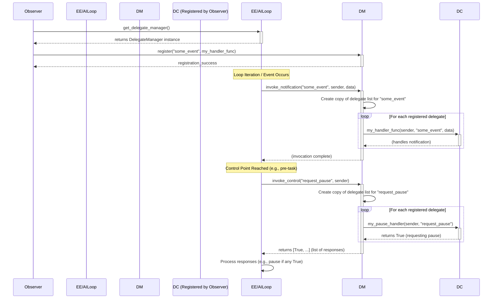

# Delegate Integration Plan for Execution Engine and AI Loop

## 1. Introduction

This document outlines the plan for integrating a thread-safe delegate system into the Execution Engine and AI Loop of the AIWhisperer project. The primary goal is to enhance monitoring and debugging capabilities by providing a loosely coupled mechanism for external components to observe and, to some extent, control these core loops. This integration is based on the principles and components described in the "Thread-Safe Delegates Design Document" and "Thread-Safe Delegates in Python - Usage Guide."

## 2. Design Principles

The integration will adhere to the following design principles:

* **Loose Coupling:** Delegates will allow the Execution Engine, AI Loop, and various observers (e.g., monitoring tools, debuggers) to interact without direct dependencies. This promotes modularity and simplifies modifications.
* **Thread Safety:** Robust thread synchronization mechanisms (`threading.Lock`, `threading.Event`, and thread-safe data structures) will be employed to ensure safe concurrent access from multiple threads. Delegate collections will be protected, and iteration will occur on copies to prevent deadlocks or race conditions during invocation.
* **Flexibility & Simplicity:** Delegates will be implemented as callable Python objects (functions, methods, or classes with `__call__`), offering a simple yet flexible interface for observers.
* **Extensibility:** The system will be designed to allow for easy addition of new delegate types and new hook points within the Execution Engine and AI Loop as requirements evolve.

## 3. Core Components Recap

The integration will leverage the following core components:

* **`DelegateManager`:** A central class responsible for:
  * Managing the registration and unregistration of delegates.
  * Invoking registered delegates for specific events or control points.
  * Ensuring thread-safe operations on delegate collections.
* **Notification Delegates:** Used for one-way communication from the Execution Engine or AI Loop to registered observers. Observers are notified of events but do not send a response that alters the loop's flow directly.
  * Signature: `def notification_delegate(sender, event_type: str, **kwargs):`
* **Control Delegates:** Used for two-way communication, allowing observers to influence the behavior of the Execution Engine or AI Loop (e.g., pausing, resuming, stopping).
  * Signature: `def control_delegate(sender, control_type: str, **kwargs) -> control_response:` (response type varies by control).

## 4. Integration Strategy

### 4.1. `DelegateManager` Implementation

* Each instance of the Execution Engine and AI Loop will own its `DelegateManager` instance.
* The `DelegateManager` will maintain a dictionary where keys are event/control types (strings) and values are lists of registered callable delegates.
* `register(event_type, delegate_callable)` and `unregister(event_type, delegate_callable)` methods will be thread-safe using `threading.Lock`.
* `invoke_notification(event_type, sender, **kwargs)` will iterate over a copy of the relevant delegate list and call each delegate.
* `invoke_control(control_type, sender, **kwargs)` will iterate similarly but may collect and process return values (e.g., for a pause request, if any delegate returns `True`, the loop pauses).

### 4.2. Integrating with the Execution Engine

The `ExecutionEngine` will be modified to incorporate delegate invocations at key points in its lifecycle.

* **Instantiation:** An instance of `DelegateManager` will be created during `ExecutionEngine` initialization.

    ```python
    # In ExecutionEngine.__init__
    self.delegate_manager = DelegateManager()
    ```

* **Hook Points & Proposed Delegates:**
  * **Notifications:**
    * `engine_started`: When the engine begins its main processing loop.
      * `self.delegate_manager.invoke_notification("engine_started", sender=self)`
    * `engine_stopped`: When the engine finishes its main processing loop.
      * `self.delegate_manager.invoke_notification("engine_stopped", sender=self)`
    * `task_execution_started`: Before a specific task/subtask begins execution.
      * `self.delegate_manager.invoke_notification("task_execution_started", sender=self, task_id=current_task.id, task_details=current_task.details)`
    * `task_execution_completed`: After a specific task/subtask finishes execution.
      * `self.delegate_manager.invoke_notification("task_execution_completed", sender=self, task_id=current_task.id, status=result.status, result_summary=result.summary)`
    * `engine_error_occurred`: If an unhandled exception occurs within the engine's main loop.
      * `self.delegate_manager.invoke_notification("engine_error_occurred", sender=self, error_type=type(e).__name__, error_message=str(e))`
  * **Controls:**
    * `engine_request_pause`: Checked at the beginning of each significant iteration or before starting a new task. If any registered delegate returns `True`, the engine will pause.

    ```python
    # In ExecutionEngine main loop
    pause_responses = self.delegate_manager.invoke_control("engine_request_pause", sender=self)
    if any(response for response in pause_responses if response is True):
        # Enter pause state (e.g., wait on a threading.Event)
        pass
    ```

    * `engine_request_stop`: Checked similarly to pause, allowing graceful shutdown.
* **Example (Conceptual):**

    ```python
    # In ExecutionEngine.run_loop()
    self.delegate_manager.invoke_notification("engine_started", sender=self)
    while not self._should_stop:
        if self._check_pause_delegates(): # Uses invoke_control
            self._wait_for_resume()
            continue
        
        current_task = self._get_next_task()
        if not current_task: break

        self.delegate_manager.invoke_notification("task_execution_started", sender=self, task_id=current_task.id)
        # ... execute task ...
        self.delegate_manager.invoke_notification("task_execution_completed", sender=self, task_id=current_task.id, status="success")
    self.delegate_manager.invoke_notification("engine_stopped", sender=self)
    ```

### 4.3. Integrating with the AI Loop

The `AILoop` will also integrate delegates for monitoring AI interactions and controlling its flow.

* **Instantiation:** An instance of `DelegateManager` will be created during `AILoop` initialization.

    ```python
    # In AILoop.__init__
    self.delegate_manager = DelegateManager()
    ```

* **Hook Points & Proposed Delegates:**
  * **Notifications:**
    * `ai_loop_started`: When the AI loop begins.
    * `ai_loop_stopped`: When the AI loop ends.
    * `ai_request_prepared`: Before an API call is made to the AI service.
      * `self.delegate_manager.invoke_notification("ai_request_prepared", sender=self, request_payload=payload, target_model=model_name)`
    * `ai_response_received`: After an API call returns from the AI service.
      * `self.delegate_manager.invoke_notification("ai_response_received", sender=self, response_data=response, tokens_used=usage.tokens, cost=usage.cost)`
    * `ai_processing_step`: For significant internal steps within the AI loop's logic (e.g., prompt generation, response parsing).
      * `self.delegate_manager.invoke_notification("ai_processing_step", sender=self, step_name="prompt_generation", details=prompt_details)`
    * `ai_loop_error_occurred`: If an unhandled exception occurs.
  * **Controls:**
    * `ai_loop_request_pause`: Checked before major operations like sending an AI request.
    * `ai_loop_request_stop`: For graceful shutdown.
* **Example (Conceptual):**

    ```python
    # In AILoop.process()
    self.delegate_manager.invoke_notification("ai_loop_started", sender=self)
    # ...
    if self._check_pause_delegates(): # Uses invoke_control
        self._wait_for_resume()
    # ...
    self.delegate_manager.invoke_notification("ai_request_prepared", sender=self, request_payload=payload)
    # ... make AI call ...
    self.delegate_manager.invoke_notification("ai_response_received", sender=self, response_data=response)
    # ...
    self.delegate_manager.invoke_notification("ai_loop_stopped", sender=self)
    ```

### 4.4. Observer Interaction

* Observers (external monitoring/debugging tools or components) will interact with the `DelegateManager` instances of the Execution Engine and AI Loop.
* The `ExecutionEngine` and `AILoop` will need to provide access to their `DelegateManager` instances (e.g., via a getter method: `get_delegate_manager()`).
* Observers will then use `delegate_manager.register(event_type, their_callable_handler)` and `delegate_manager.unregister(...)`.
* The callables provided by observers must match the expected delegate signatures.

## 5. Thread Safety Mechanisms

* All modifications to delegate collections within `DelegateManager` (register, unregister) will be protected by a `threading.Lock`.
* During invocation (`invoke_notification`, `invoke_control`), the `DelegateManager` will iterate over a *copy* of the list of registered delegates for a given event/control type. This prevents holding the lock during potentially long-running delegate calls, avoiding deadlocks and allowing concurrent registration/unregistration.
* **Guidance for Delegate Implementers:** While the `DelegateManager` ensures its own thread safety, the callables registered as delegates must themselves be thread-safe if they access or modify shared state outside the scope of the arguments passed to them.

## 6. Error Handling Strategy

* Errors occurring *within* a delegate's execution should be handled gracefully to prevent crashing the Execution Engine or AI Loop.
* The `DelegateManager`'s invocation logic will wrap calls to individual delegates in a `try...except` block.
* By default, exceptions raised by a delegate will be logged (e.g., using the project's standard logging mechanism).
* A special notification delegate, `delegate_execution_error(event_type, delegate_name, error)`, could be invoked by the `DelegateManager` itself to inform observers about a faulty delegate.
* The main loop (Execution Engine / AI Loop) will not be halted by an error in a delegate unless a specific control delegate for error handling dictates otherwise.

## 7. Pause/Resume/Stop Functionality

* **Pause:**
    1. The Execution Engine/AI Loop periodically calls `delegate_manager.invoke_control("engine_request_pause" / "ai_loop_request_pause", sender=self)`.
    2. If any registered control delegate returns `True`, the loop enters a paused state.
    3. In the paused state, the loop might periodically check a `threading.Event` or re-invoke the pause delegates (which could now return `False` if a resume is requested by the observer that initially requested the pause).
* **Resume:**
    1. An observer that previously requested a pause (by returning `True` from its pause control delegate) can signal a resume by subsequently having its pause control delegate return `False` or by interacting with a `threading.Event` that the paused loop is waiting on.
* **Stop:**
    1. Similar to pause, `delegate_manager.invoke_control("engine_request_stop" / "ai_loop_request_stop", sender=self)` is called.
    2. If `True` is returned, the loop initiates a graceful shutdown procedure (e.g., finishing current micro-task, cleaning up resources, then exiting).

## 8. Diagram: Delegate Interaction Flow



## 9. Future Considerations

* **Asynchronous Delegate Invocation:** For notification delegates that might be long-running, consider options for invoking them asynchronously (e.g., in a separate thread pool managed by `DelegateManager`) to avoid blocking the main loops.
* **Filtered Delegates:** Allow observers to register delegates with specific filters, so they are only invoked if the event data matches certain criteria.
* **Standardized Delegate Payloads:** Define clear schemas or dataclasses for the `**kwargs` passed to delegates for common events to improve discoverability and reduce errors.

## 10. Summary

This plan details the integration of a thread-safe delegate system into the Execution Engine and AI Loop. By introducing `DelegateManager` and defining clear hook points for notification and control delegates, we aim to significantly improve the observability and debuggability of these critical components in a loosely coupled and thread-safe manner. The implementation will focus on the core mechanics outlined, providing a solid foundation for future enhancements.
